

  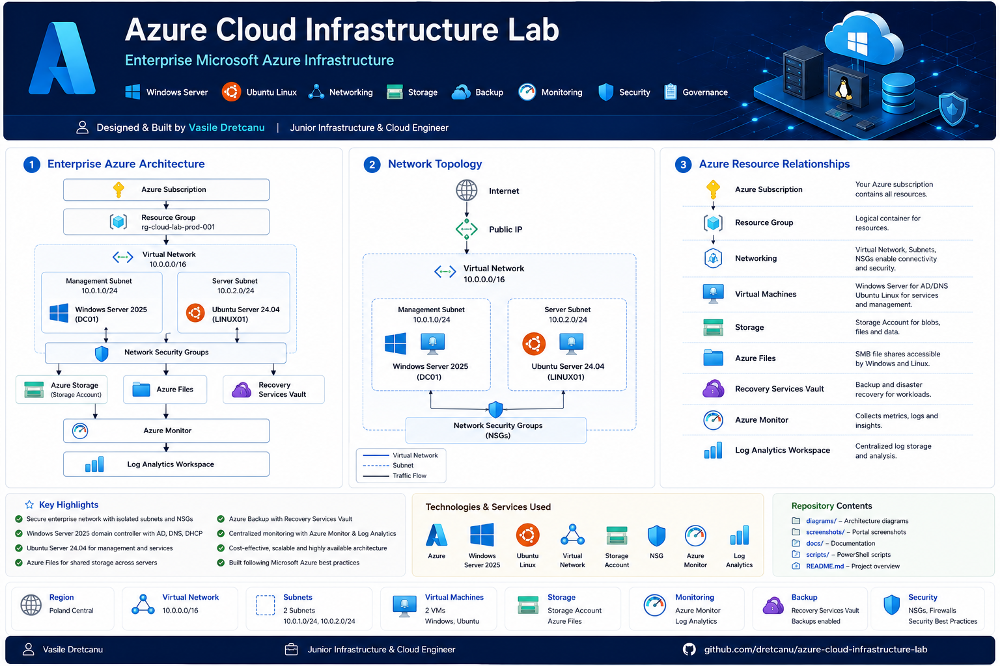

<h1 align="center">☁ Azure Cloud Infrastructure Lab</h1>

<strong>Enterprise Microsoft Azure Infrastructure</strong>

  Windows Server 2025 • Ubuntu Server 24.04 • Azure Networking • Storage • Backup • Monitoring • Security • Governance

  
  
  
  

Table of Contents

Project Overview

Quick Facts

Objectives

Solution Architecture

Network Design

Infrastructure Components

Technical Decisions

Security Hardening

Storage and File Services

Backup and Recovery

Monitoring

Governance

Cost Management

Validation

Challenges Encountered

Screenshot Gallery

Lessons Learned

Future Improvements

Repository Structure

Author

Project Overview

This project demonstrates the planning, deployment, security and documentation of a small enterprise-style infrastructure environment in Microsoft Azure.

The lab combines cloud networking, Windows Server, Ubuntu Linux, storage, backup, monitoring, governance and cost control. It was designed to demonstrate practical skills relevant to Junior Infrastructure Engineer, Junior Cloud Engineer and Junior Systems Administrator roles.

The environment includes:

A dedicated Azure Resource Group

A segmented Azure Virtual Network

Windows Server 2025 and Ubuntu Server 24.04 virtual machines

Network Security Groups

Azure Storage and Azure Files

A Recovery Services Vault and Azure Backup

Azure Monitor and Log Analytics

Managed identities and storage hardening

Resource tagging and cost analysis

Quick Facts

Category

Details

Project status

✅ Completed

Cloud platform

Microsoft Azure

Region

Poland Central

Infrastructure model

Infrastructure as a Service

Windows operating system

Windows Server 2025

Linux operating system

Ubuntu Server 24.04 LTS

Network design

Multi-subnet virtual network

Storage redundancy

Locally Redundant Storage

Backup

Recovery Services Vault

Monitoring

Azure Monitor and Log Analytics

Documentation

Complete

Objectives

Design and deploy a secure Azure infrastructure environment.

Configure a segmented virtual network using multiple subnets.

Deploy Windows Server and Ubuntu Linux virtual machines.

Apply traffic filtering through Network Security Groups.

Configure secure Azure Storage and Azure Files.

Protect workloads using Azure Backup.

Deploy monitoring and centralised logging resources.

Apply governance through tagging and cost review.

Validate connectivity and document the completed environment.

Solution Architecture

  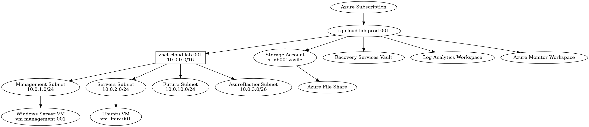

The solution is contained within the Resource Group rg-cloud-lab-prod-001 and uses the Virtual Network vnet-cloud-lab-001 with the address space 10.0.0.0/16.

The design separates management and server workloads while retaining space for future expansion.

Network Design

  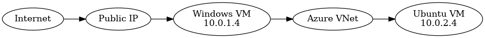

Virtual Network

Resource

Configuration

Virtual Network

vnet-cloud-lab-001

Address space

10.0.0.0/16

Region

Poland Central

Subnets

Subnet

Address range

Purpose

Management

10.0.1.0/24

Windows Server and management workloads

Servers

10.0.2.0/24

Ubuntu Linux and server workloads

AzureBastionSubnet

10.0.3.0/26

Reserved for Azure Bastion

Future

10.0.10.0/24

Reserved for future expansion

Network Security Groups were associated with the relevant subnets and interfaces to restrict inbound management traffic and support the principle of least privilege.

Infrastructure Components

  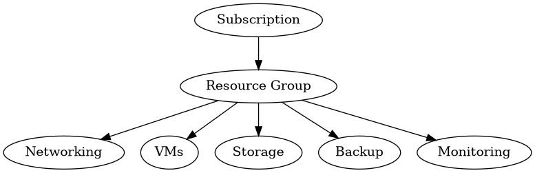

Component

Purpose

Azure Subscription

Contains the deployed Azure resources

Resource Group

Provides a logical management boundary

Virtual Network

Provides private IP connectivity

Management subnet

Hosts the Windows Server workload

Server subnet

Hosts the Ubuntu Linux workload

Windows Server 2025 VM

Demonstrates Windows infrastructure administration

Ubuntu Server 24.04 VM

Demonstrates Linux server administration

Network Security Groups

Filter inbound and outbound traffic

Storage Account

Provides secure cloud storage

Azure Files

Provides SMB-compatible shared storage

Recovery Services Vault

Provides backup and recovery services

Azure Monitor Workspace

Supports monitoring capabilities

Log Analytics Workspace

Provides centralised log collection and analysis

Technical Decisions

Why multiple subnets?

Separate subnets were used to isolate management and server workloads. This reflects common enterprise network segmentation practices and provides a clearer security boundary than placing all systems in one subnet.

Why B-series virtual machines?

Burstable B-series virtual machines were selected because they provide sufficient performance for a portfolio lab while helping to control Azure expenditure.

Why Locally Redundant Storage?

Locally Redundant Storage was selected to reduce costs while still demonstrating Azure storage redundancy. Higher redundancy tiers would be more appropriate for workloads with stricter resilience requirements.

Why Network Security Groups?

Network Security Groups were used to restrict inbound management access and reduce unnecessary exposure. Only the access required for administration and testing was permitted.

Why resource tags?

Tags improve organisation, ownership visibility and cost tracking. The following categories were applied to key resources:

Environment

Project

Owner

CostCenter

Security Hardening

The following security measures were implemented:

Network segmentation using dedicated subnets

Network Security Groups

Secure Transfer Required

TLS 1.2

Anonymous Blob Access disabled

System-assigned managed identity

User-assigned managed identity where required

Resource tagging

Restricted administrative access

Storage security review

These controls demonstrate practical security awareness without claiming that the lab represents a complete production security architecture.

Storage and File Services

A dedicated Azure Storage Account was deployed and hardened.

Configured features include:

Locally Redundant Storage

Secure Transfer Required

TLS 1.2

Anonymous access disabled

Azure File Share

Shared file storage accessible from supported systems

Azure Files was included to demonstrate managed shared storage without deploying and maintaining a separate file server.

Backup and Recovery

Azure Backup was configured through a Recovery Services Vault.

The backup implementation included:

Recovery Services Vault

Backup policy

Virtual machine protection

Recovery point management

Backup status validation

This demonstrates basic business continuity and disaster recovery principles.

Monitoring

The monitoring layer includes:

Azure Monitor Workspace

Log Analytics Workspace

Managed identities

Platform monitoring resources

Automated VM Insights onboarding encountered a regional limitation because the required metric alert resource type was unavailable in Poland Central.

The monitoring workspaces were retained and the limitation was documented rather than misrepresenting the failed onboarding as complete. This reinforced the importance of checking regional service availability during cloud solution planning.

Governance

Governance measures included:

Consistent resource naming

Dedicated Resource Group

Resource tags

Cost review

Logical workload separation

Documentation of technical decisions and limitations

Cost Management

Azure Cost Analysis was reviewed throughout the project.

The observed project cost was approximately £1.76 at the time of review. Storage was the largest contributor, while backup and networking costs remained comparatively small.

Cost-control decisions included:

B-series virtual machines

Locally Redundant Storage

Standard storage services

Avoiding unnecessary premium services

Reviewing Cost Analysis

Using resource tags to support cost tracking

Azure prices change over time, so the amount above represents the observed lab cost rather than a permanent estimate.

Validation

Test

Result

Resource Group deployment

✅

Virtual Network deployment

✅

Subnet configuration

✅

Network Security Group configuration

✅

Windows Server VM deployment

✅

Ubuntu Linux VM deployment

✅

RDP connectivity

✅

SSH connectivity

✅

Internal VM communication

✅

Storage Account configuration

✅

Azure Files creation

✅

Recovery Services Vault deployment

✅

Azure Backup configuration

✅

Azure Monitor Workspace deployment

✅

Log Analytics Workspace deployment

✅

Resource tagging

✅

Cost Analysis review

✅

Challenges Encountered

Regional virtual machine availability

Some VM images and sizes were unavailable in the initially considered regions. The available regions and sizes were reviewed before selecting a supported configuration in Poland Central.

Azure Bastion availability

The Developer SKU was not available for the subscription and region combination used for the lab. The reserved Azure Bastion subnet remains available for a future implementation.

Monitoring deployment limitation

VM Insights onboarding failed because a required metric-alert resource type was unavailable in Poland Central. The core monitoring resources were retained and the limitation was documented.

Managed identity requirements

Additional identity configuration was required during monitoring setup. Both system-assigned and user-assigned identity concepts were reviewed and applied where appropriate.

Backup compatibility

Backup configuration required attention to virtual machine security and policy compatibility. The selected configuration was adjusted and validated.

Screenshot Gallery

Azure Portal and Subscription

  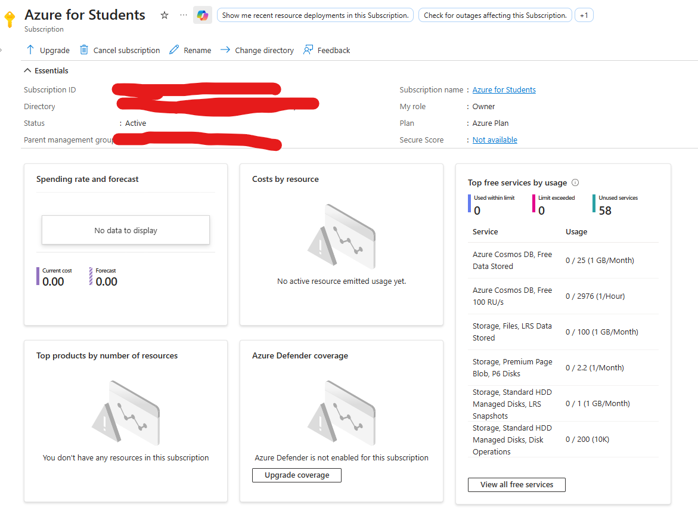

Resource Group

  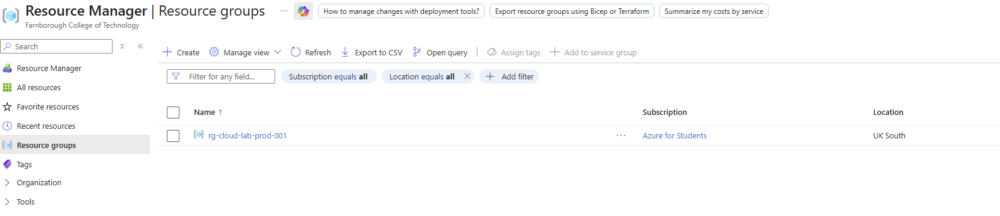

Resource Tags

  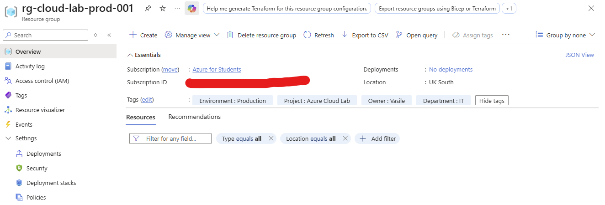

Virtual Network and Subnets

  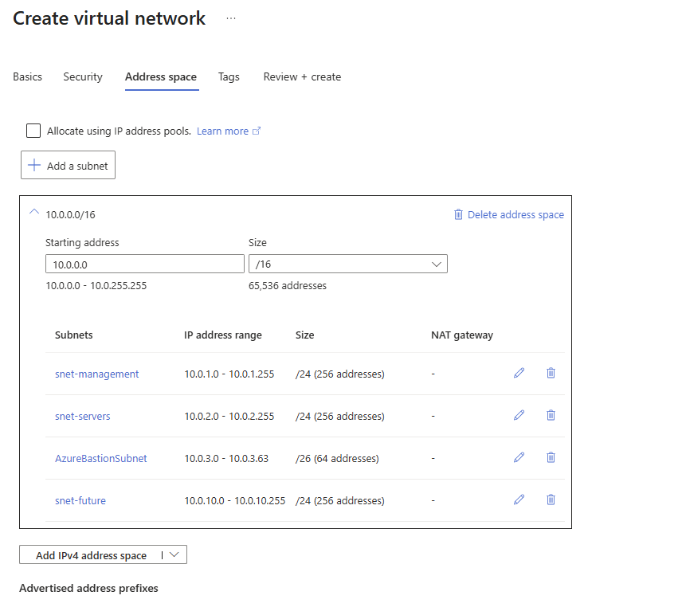

Virtual Network Overview

  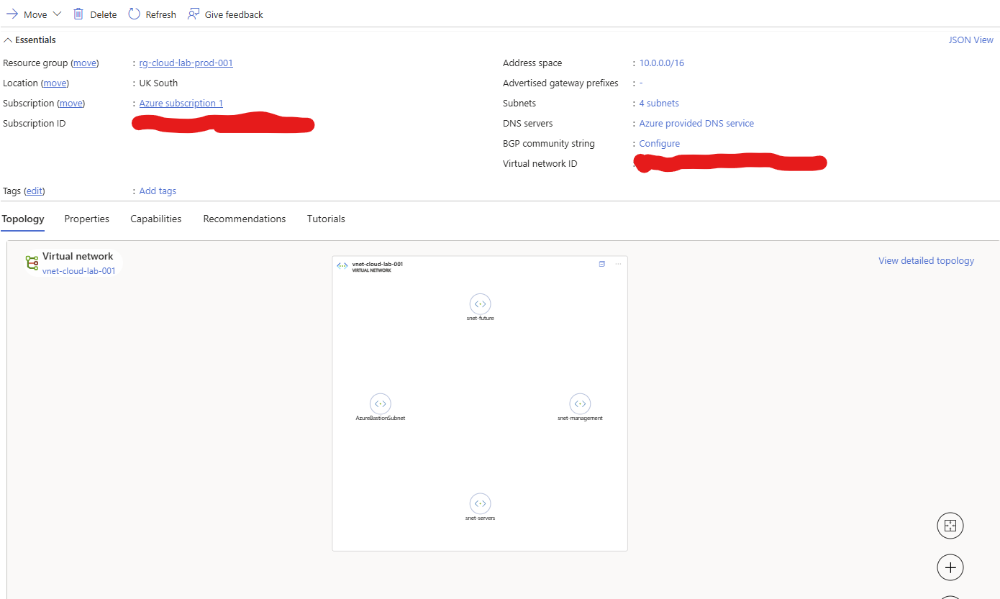

Virtual Machines

  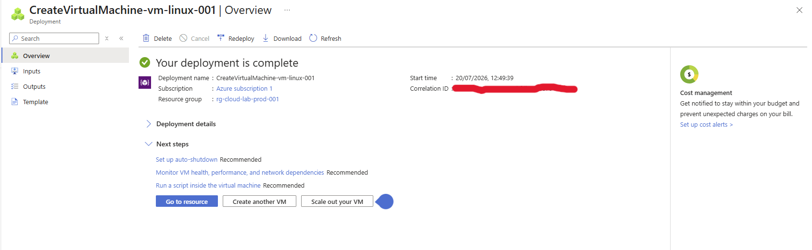

Cost Analysis

  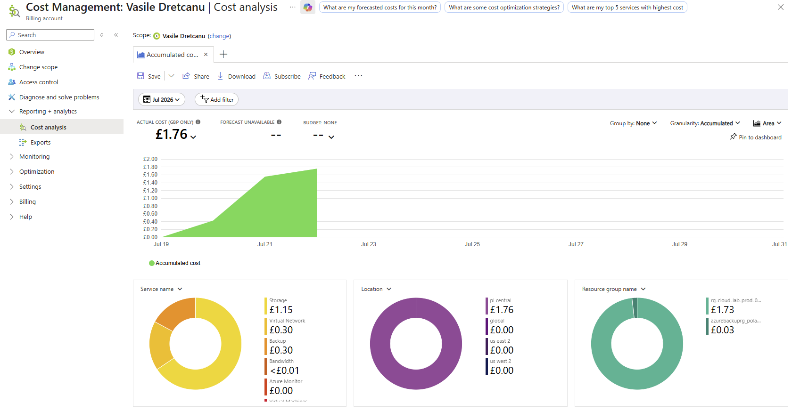

Lessons Learned

This project reinforced that cloud infrastructure is broader than virtual machine deployment.

A well-designed environment also requires network planning, security controls, storage design, backup and recovery, monitoring, governance, cost awareness, validation and clear documentation.

The deployment challenges were particularly valuable because they required investigation, adaptation and honest documentation of platform limitations.

Future Improvements

Logical future enhancements include:

Azure Bastion

Azure Key Vault

Azure Policy

Azure Update Manager

VPN Gateway

Azure Firewall

Private endpoints

Infrastructure as Code using Bicep or Terraform

More extensive monitoring and alerting

Automated deployment validation

These improvements are intentionally listed as future development rather than presented as completed work.

Repository Structure

azure-cloud-infrastructure-lab/
│
├── README.md
├── LICENSE
├── .gitignore
│
├── diagrams/
│   ├── azure-project-overview.png
│   ├── azure-architecture-overview.png
│   ├── network-topology.png
│   └── resource-group-structure.png
│
├── screenshots/
│   ├── 01-azure-portal-account-active.png
│   ├── 03-resource-group-tags.png
│   ├── 04-resource-group-created.png
│   ├── 05-vnet-subnets.png
│   ├── 07-vnet-overview.png
│   ├── 08-vm-overview.png
│   └── 14-cost-analysis.png
│
└── docs/

Author

Vasile DretcanuJunior Infrastructure & Cloud Engineer

GitHub: github.com/dretcanu

Education: HNC and HND Computing completed

BSc (Hons) Computing (Top-Up): Starting September 2026

Related Portfolio Projects

Enterprise Campus Network Design

Python Network Automation Toolkit

Enterprise Linux Infrastructure Lab

<strong>Designed, built and documented by Vasile Dretcanu</strong>

